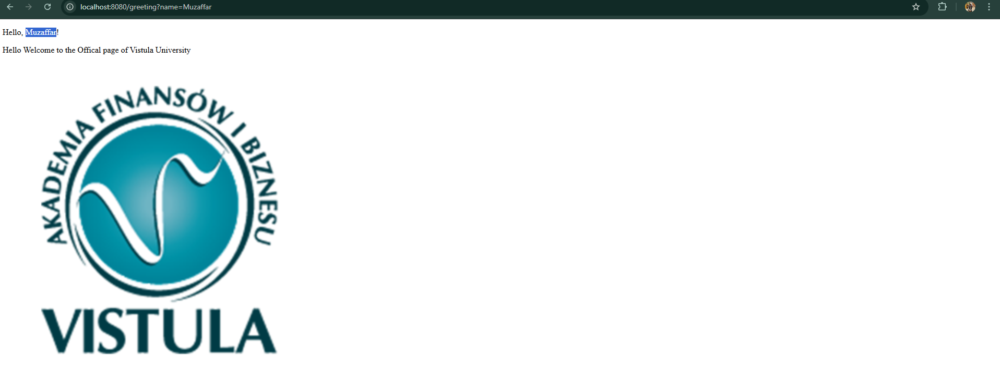

# Task 1: First Spring Boot Application

## Project Overview
- First application built using **Spring Boot**
- Project created from scratch
- Goal: understand basic Spring Boot setup and HTTP request handling
- Implemented a simple web controller
- Handled HTTP requests using **plain text responses**

---

## Localhost Outcome (Default Greeting)
- Application runs on default URL:
  http://localhost:8080/
- Endpoint uses `@RestController`
- Returns a simple **text message** directly in the browser
- No HTML templates used at this stage
---

---
## Dynamic Greeting (Changing the Name)
- I implemented a dynamic greeting at http://localhost:8080/greeting/name=input. 
- By adding a name parameter to the URL, the application updates the view using Thymeleaf.
---
## `Input: name=Vistula`

--- 
## `Input: name= My Name (Muzaffar)`

---

## Project Implementation Details

### Controller
- Created **`HelloController`** to handle web traffic
- Maps HTTP requests to methods
- Returns responses as either plain text or HTML view

### View
- Created **`greeting.html`** for the frontend
- Displays user name
- Includes **Vistula logo** (`vistula.png`)

### Technologies
- **Java**
- **Maven**
- **Spring Web**
- **Thymeleaf**

---

## How to Run
1. Open the project in your IDE (e.g., IntelliJ IDEA)
2. Run the **`FirstProjectJavaSpringApplication`** class
3. Navigate to [http://localhost:8080/](http://localhost:8080/) in your browser
4. View the greeting message and HTML page with Vistula logo

