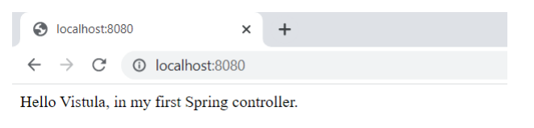
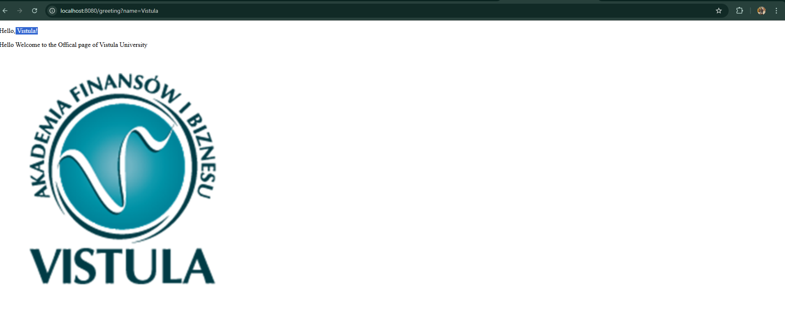

# Task 1: First Spring Boot Application

## Project Overview
- First application built using **Spring Boot**
- Project created from scratch
- Goal: understand basic Spring Boot setup and HTTP request handling
- Implemented a simple web controller
- Handled HTTP requests using **plain text responses**

---

## Localhost Outcome (Default Greeting)
- Application runs on default URL:
  http://localhost:8080/
- Endpoint uses `@RestController`
- Returns a simple **text message** directly in the browser
- No HTML templates used at this stage
---

---
## Dynamic Greeting (Changing the Name)
- I implemented a dynamic greeting at http://localhost:8080/greeting/name=input. 
- By adding a name parameter to the URL, the application updates the view using Thymeleaf.
`Input: name=Vistula`

